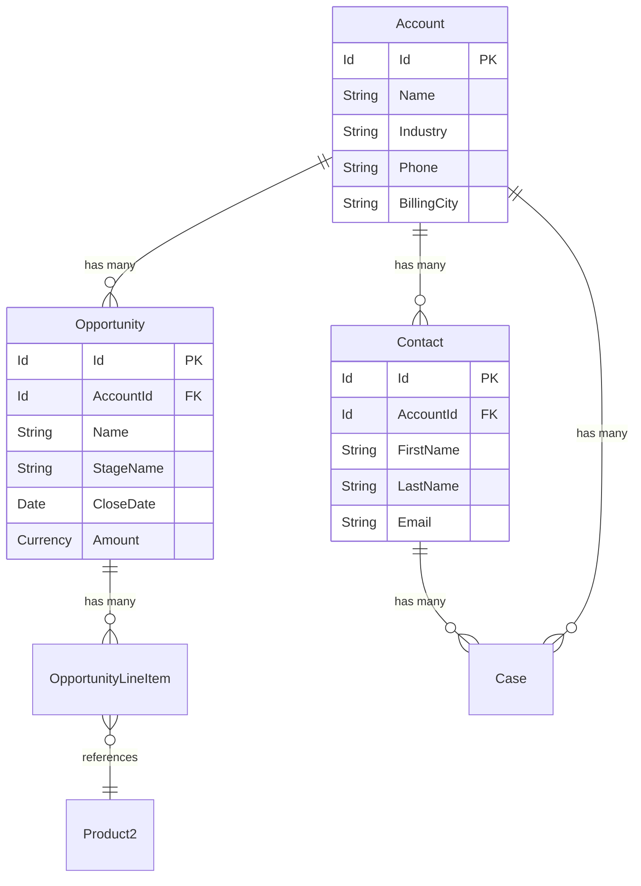
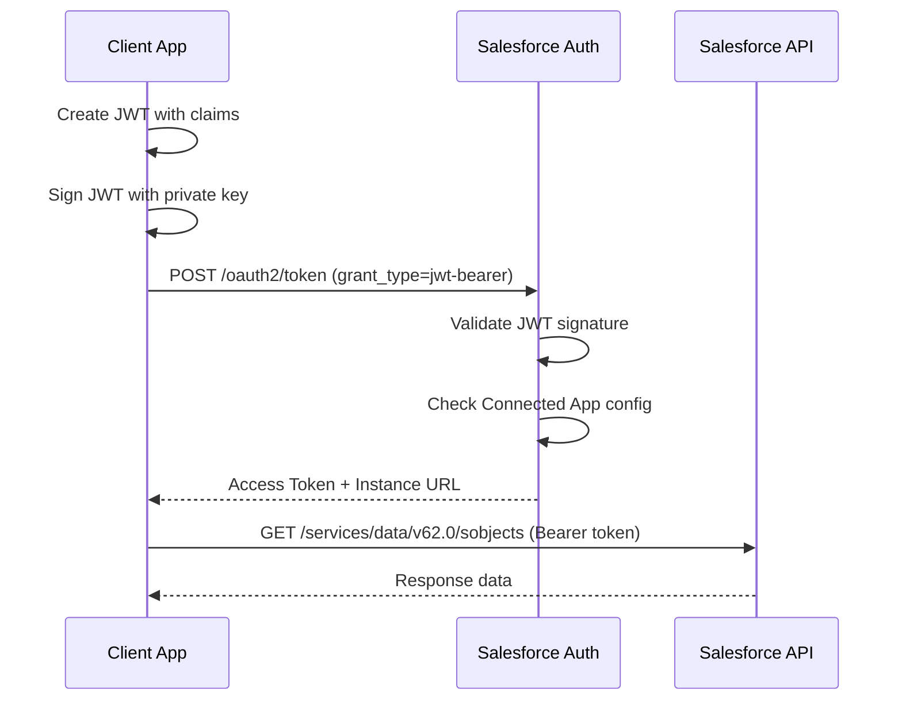
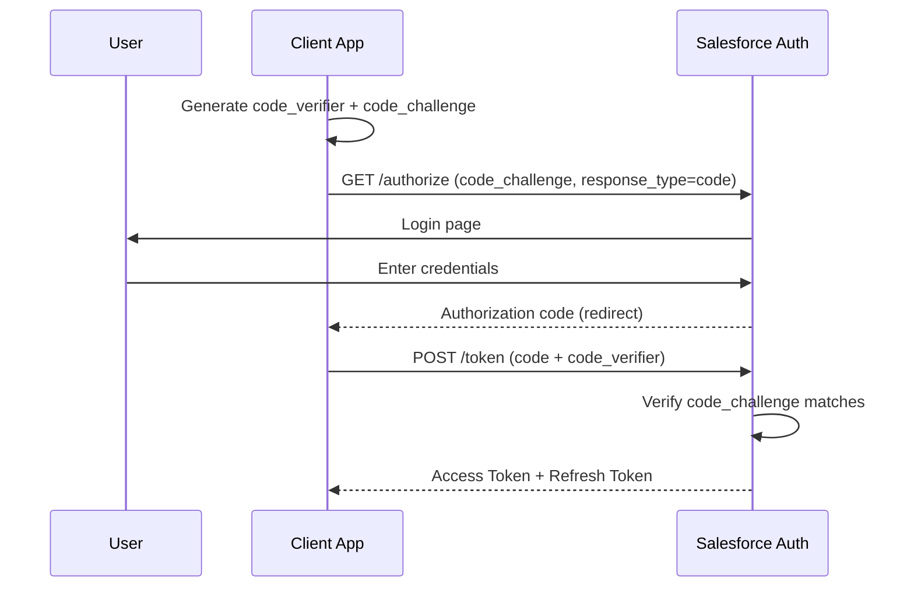
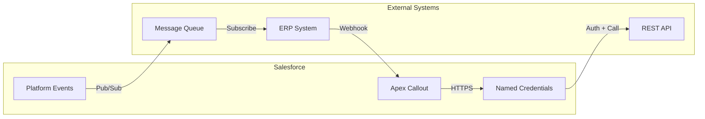
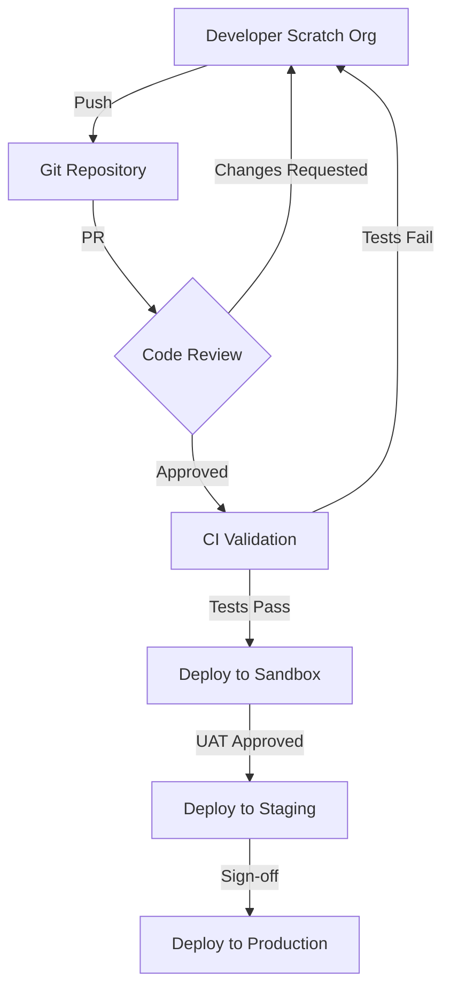
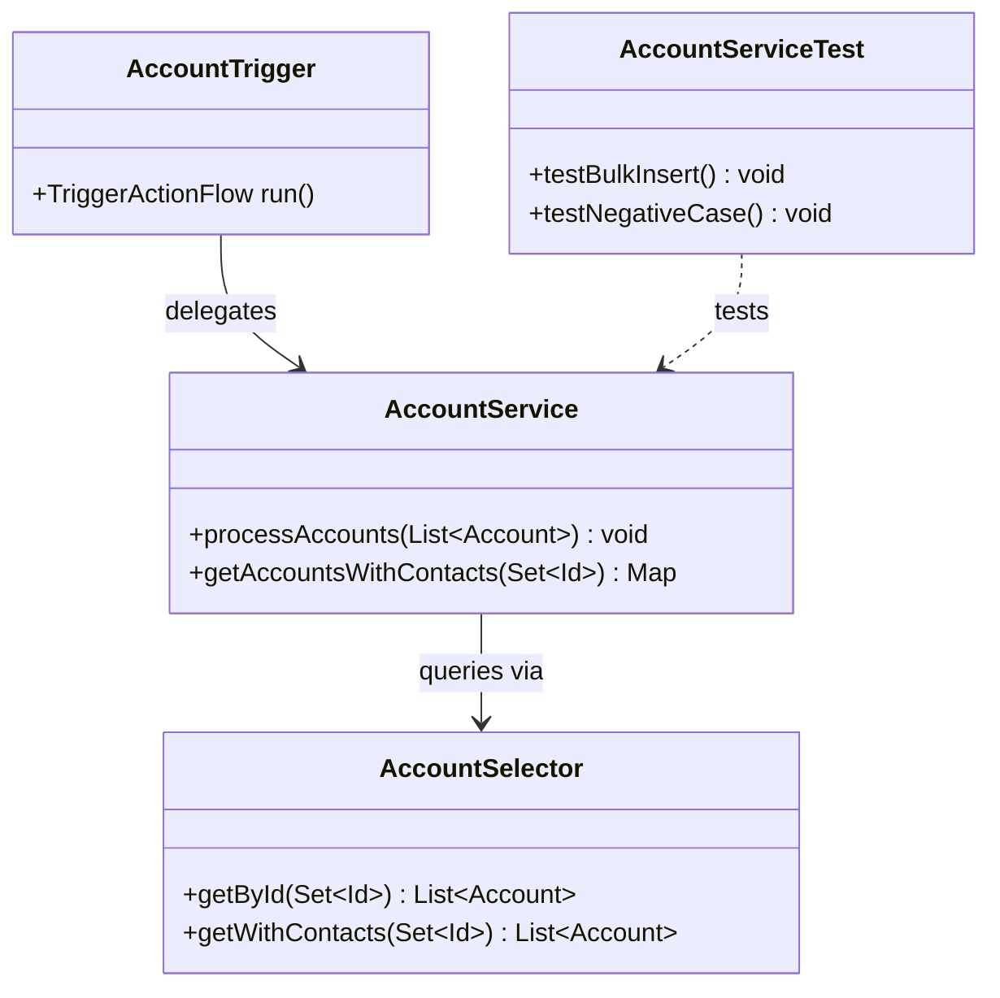

# Mermaid Diagrams for Salesforce

## Core Responsibilities

1. Generate Entity Relationship Diagrams (ERD) for Salesforce objects
2. Create sequence diagrams for OAuth flows
3. Build integration architecture diagrams
4. Design system landscape and deployment diagrams
5. Visualize Flow logic and agent conversation trees

## Diagram Types

### ERD — Entity Relationship Diagram

### Sequence — JWT Bearer OAuth Flow

### Sequence — Authorization Code + PKCE

### Flowchart — Integration Architecture

### Flowchart — Deployment Pipeline

### Class Diagram — Apex Architecture

## Workflow

### Phase 1 — Gather Context

- Identify the objects, relationships, or flows to diagram
- Determine the diagram type (ERD, sequence, flowchart, class)
- Identify the audience (technical vs business)

### Phase 2 — Generate

- Use the appropriate Mermaid syntax for the diagram type
- Keep diagrams readable (max ~15 nodes per diagram)
- Use clear labels and descriptive relationship text
- Split large diagrams into multiple focused diagrams

### Phase 3 — Render

Mermaid diagrams render natively in:
- GitHub Markdown files
- Cursor IDE preview
- Confluence (with Mermaid plugin)
- VS Code Markdown preview

## Best Practices

- Use PascalCase for node names (no spaces)
- Keep diagrams focused — one concept per diagram
- Add descriptions to relationships
- Use subgraphs to group related elements
- Limit complexity: if > 15 nodes, split into sub-diagrams
- Use consistent direction (TD for hierarchies, LR for flows)

## Cross-Skill References

- For object metadata to diagram: see **sf-metadata**
- For OAuth flows: see **sf-connected-apps**
- For integration architecture: see **sf-integration**
- For agent conversation flows: see **sf-ai-agentscript**
